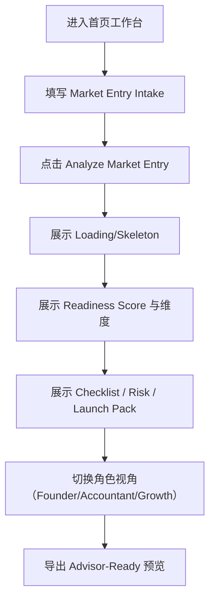

## 1. 产品概述
SEA Launch Copilot 是一套面向中小企业（SME）的 AI 工作台，帮助品牌以 TikTok-first 的方式进入东南亚市场（Demo 聚焦“湖南菜/中餐 F&B 品牌进入新加坡”）。
- 解决的问题：跨角色协作下的市场进入准备（合规/税务、财务、风险、在地化、社媒内容与投放动作）信息分散、决策不一致、交付物难以整理的问题
- 目标价值：用一次 Intake + 一次分析，产出“可执行的准备度评分、清单、风险与行动包”，并能导出给顾问/合作方审阅

## 2. 核心功能

### 2.1 用户角色
| 角色 | 进入方式 | 核心权限 |
|------|----------|----------|
| Founder（创始人） | 直接进入 Demo | 填写 Intake、发起分析、查看总览、审批关键决策、导出 Advisor 包 |
| Accountant（会计/财务） | 切换角色标签 | 查看税务/财务清单、资金测算输入位、风险条目与证据材料需求 |
| Localization/Growth（在地化/增长） | 切换角色标签 | 查看在地化建议、TikTok Launch Pack、内容/投放/达人行动清单与素材需求 |

### 2.2 功能模块（页面级）
1. **单页工作台（首页即流程）**
   - Market Entry Intake Form（进入准备输入）
   - AI Readiness Dashboard（准备度评分与维度概览）
   - Compliance & Tax Checklist（合规与税务清单）
   - Risk Register（风险台账）
   - Localization & TikTok Launch Pack（在地化与 TikTok-first 行动包）
   - Advisor-Ready Export Preview（顾问审阅导出预览）

### 2.3 页面明细
| 页面名称 | 模块名称 | 功能描述 |
|----------|----------|----------|
| 首页工作台 | 顶部角色标签 | Founder / Accountant / Localization-Growth 三角色视角切换，改变默认展开区域与信息强调 |
| 首页工作台 | Intake 表单 | 品牌信息、品类与定价、经营模式、团队与预算、预计上线时间、合规关注点；支持保存草稿（前端本地） |
| 首页工作台 | Analyze 按钮与状态 | 点击“Analyze Market Entry”后进入 loading skeleton；先用 mock JSON，预留 `/api/analyze-market-entry` 连接位 |
| 首页工作台 | Readiness Score | 总分 + 维度分（合规/税务、财务、在地化、社媒与增长、运营准备）；显示“下一步优先级” |
| 首页工作台 | Checklist | 按类别分组；每项包含负责人角色、截止建议、证据材料、风险关联；支持勾选与筛选（角色/优先级） |
| 首页工作台 | Risk Register | 表格：风险、影响、概率、缓解动作、负责人、状态；支持按角色与等级筛选 |
| 首页工作台 | Launch Pack | 在地化：菜单/文案/品牌名建议；TikTok：内容支柱、首发 14 天日历、达人合作 brief、直播脚本要点、投放动作 |
| 首页工作台 | Export Preview | 以“Advisor-ready”排版预览：封面摘要、评分、清单与风险、Launch Pack；支持复制/下载（Demo 可先做复制与打印样式） |

## 3. 核心流程
1. 用户进入首页（默认 Founder 视角），看到 Intake + 右侧空状态的 Dashboard
2. 填写 Intake（或使用预填 Demo 数据），点击 “Analyze Market Entry”
3. 前端进入分析 loading（mock 延迟），得到分析结果并渲染：评分、清单、风险、Launch Pack、导出预览
4. 切换角色标签：同一份分析结果在不同角色下突出不同内容，并提供“交接提示”（Owner/Next actions）
5. Demo 阶段：支持勾选清单与修改风险状态，数据保持在前端状态（可选 localStorage）

## 4. 用户界面设计

### 4.1 设计风格
- 定位：严肃的 B2B SaaS 工作台（非营销落地页），强调信息密度、清晰层级、任务驱动
- 颜色：中性浅底（雾白/浅灰）+ 单一高对比强调色（深青/靛蓝系）+ 风险态颜色（黄/红）用于状态提示
- 字体：标题使用更有性格的衬线/展示字体（如 Fraunces），正文使用易读的无衬线（如 IBM Plex Sans）；强调可读性与专业感
- 布局：桌面优先的两栏工作台（左侧主流程/表单，右侧分析摘要与待办），顶部固定工具栏（角色标签、导出、状态）
- 组件策略：卡片仅用于承载“摘要与关键指标”；清单与风险优先使用表格/分组列表；避免过度装饰
- 动效：页面进入与分析完成时的轻微过渡；hover 与 focus 明确；loading 使用 skeleton 而非转圈为主

### 4.2 页面设计总览
| 页面名称 | 模块名称 | UI 元素 |
|----------|----------|----------|
| 首页工作台 | 顶部工具栏 | Logo（小）、角色 Tabs、Analyze 按钮、Export 按钮、最近更新时间 |
| 首页工作台 | 左侧主栏 | Intake 分段表单、校验提示、保存草稿、Demo 一键填充 |
| 首页工作台 | 右侧摘要栏 | Readiness Score 卡、维度条、优先级 Next actions 列表 |
| 首页工作台 | 清单/风险/Launch | 分区导航（锚点/分段控件）、表格与分组列表、标签与筛选器 |
| 首页工作台 | Export 预览 | A4 预览容器、章节目录、复制/打印样式、可选下载按钮（Demo） |

### 4.3 响应式
- 桌面：双栏布局（主栏 + 摘要栏），内容分区可滚动
- 平板：摘要栏下移为顶部折叠面板，清单与风险表格支持横向滚动
- 手机：单列，角色 Tabs 固定顶部；表格自动切换为卡片列表；导出预览提供“仅摘要”模式
