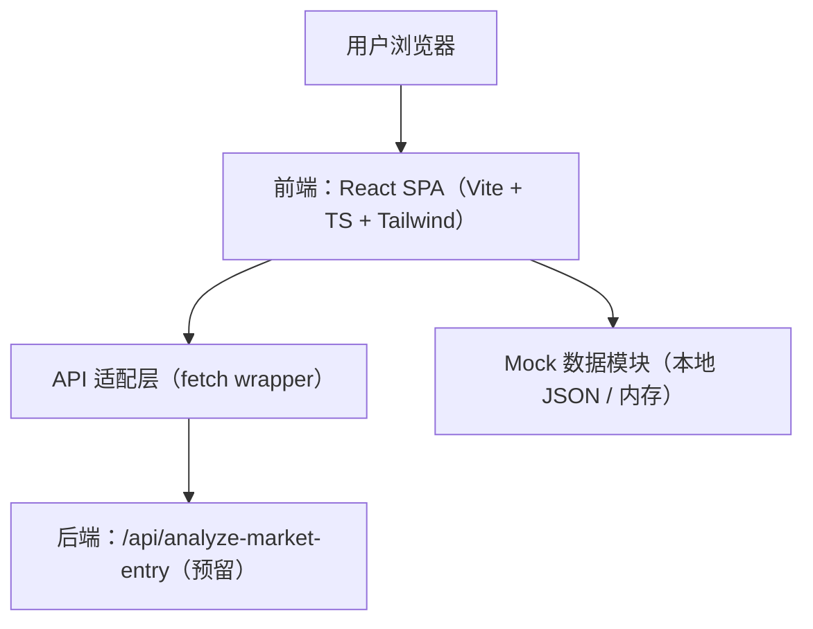
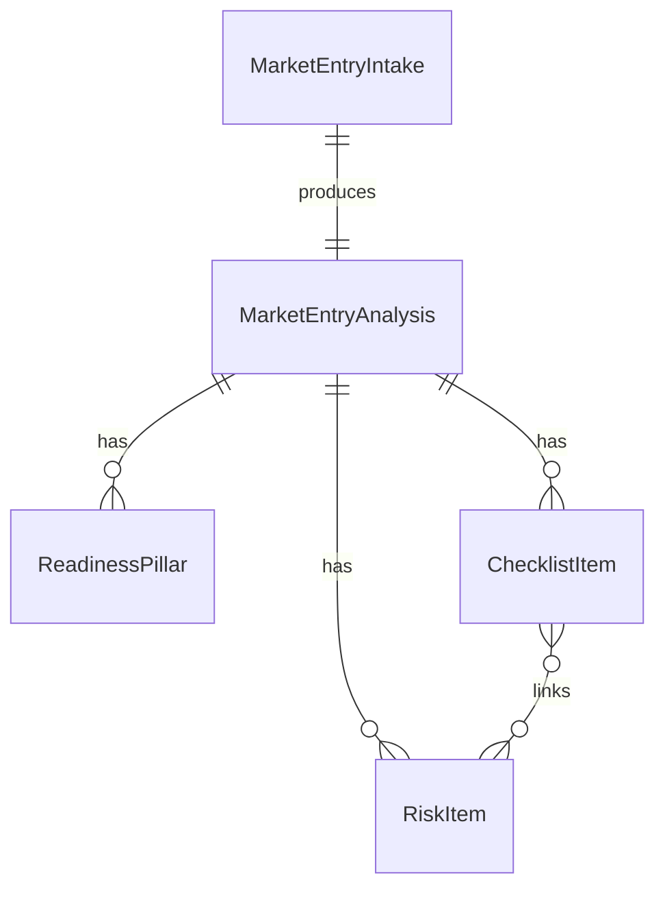

## 1. 架构设计



## 2. 技术说明
- 前端：React@18 + TypeScript + Vite
- 样式：tailwindcss@3（配合 CSS 变量做主题与密度控制）
- 组件：自建基础组件（Button/Tab/Table/Badge/Skeleton），避免强依赖第三方组件库
- 路由：react-router-dom（可选；Demo 可先单页，但保留未来拆分 `/export` 的空间）
- 数据获取：先走 mock + 延迟模拟；后续一键切换为真实 API（保持相同的 TypeScript 类型）
- 状态：React hooks（useReducer/useMemo）+ localStorage（草稿与勾选状态，Demo 友好）

## 3. 路由定义
| Route | 目的 |
|------|------|
| / | 首页工作台：Intake + Dashboard（主流程） |
| /export | Advisor-Ready 导出预览（可选独立路由，亦可用 Modal/Drawer） |

## 4. API 定义（预留后端）

### 4.1 请求与响应类型（TypeScript）
```ts
export type Role = "founder" | "accountant" | "growth";

export type MarketEntryIntake = {
  companyName: string;
  brandName: string;
  industry: "F&B" | "Retail" | "Services" | "Other";
  originCountry: string;
  targetMarket: "Singapore" | "Malaysia" | "Thailand" | "Indonesia" | "Vietnam";
  cuisineType?: string;
  pricePositioning: "value" | "mid" | "premium";
  businessModel: "dine-in" | "delivery" | "hybrid";
  monthlyBudgetSgd: number;
  launchTimelineWeeks: number;
  teamSize: number;
  hasLocalEntity: boolean;
  notes?: string;
};

export type ReadinessPillarId =
  | "compliance_tax"
  | "finance_ops"
  | "localization"
  | "tiktok_social_commerce"
  | "execution";

export type ReadinessPillar = {
  id: ReadinessPillarId;
  label: string;
  score: number; // 0-100
  insight: string;
};

export type ChecklistItem = {
  id: string;
  category: "Compliance" | "Tax" | "Finance" | "Operations" | "Localization" | "TikTok";
  title: string;
  ownerRole: Role;
  priority: "P0" | "P1" | "P2";
  evidence?: string;
  dueSuggestion?: string;
  status: "todo" | "in_progress" | "done" | "blocked";
  linkedRiskIds?: string[];
};

export type RiskItem = {
  id: string;
  risk: string;
  impact: "low" | "medium" | "high";
  likelihood: "low" | "medium" | "high";
  mitigation: string;
  ownerRole: Role;
  status: "open" | "watch" | "mitigating" | "closed";
};

export type LocalizationSuggestion = {
  area: "Brand" | "Menu" | "Copy" | "Pricing" | "Operational";
  suggestion: string;
  rationale: string;
};

export type TikTokAction = {
  phase: "Week0" | "Week1" | "Week2" | "AlwaysOn";
  title: string;
  why: string;
  ownerRole: Role;
  artifacts?: string[];
};

export type MarketEntryAnalysis = {
  generatedAt: string;
  readinessScore: number;
  pillars: ReadinessPillar[];
  checklist: ChecklistItem[];
  risks: RiskItem[];
  localization: LocalizationSuggestion[];
  tiktokActions: TikTokAction[];
  advisorExport: {
    executiveSummary: string;
    keyDecisions: string[];
    appendixNotes?: string[];
  };
};
```

### 4.2 接口约定
- `POST /api/analyze-market-entry`
  - Request: `MarketEntryIntake`
  - Response: `MarketEntryAnalysis`
  - 失败：返回 `{ error: string }`（前端显示可恢复错误态与重试）

## 5. 目录结构建议
- `src/pages/Dashboard`：单页工作台（Intake + 分区内容）
- `src/components/ui`：基础组件（Button/Tab/Table/Badge/Skeleton/Field）
- `src/features/market-entry`：类型、mock、API client、selectors（按领域聚合）
- `src/styles`：主题变量、密度与打印样式（Export 用）

## 6. 数据模型（前端视角）


